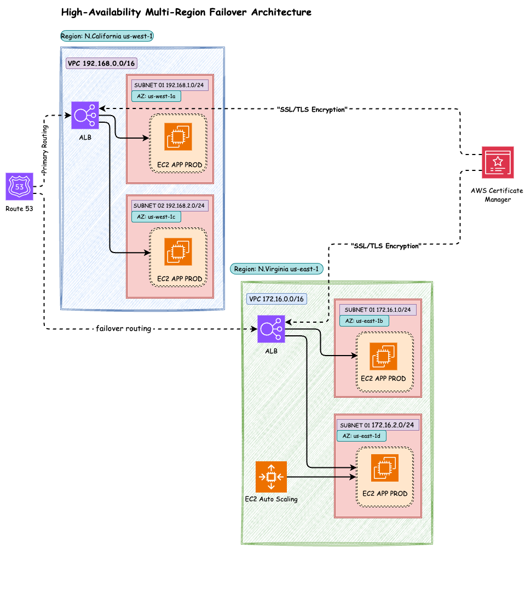

# aws-multi-region-failover-architecture
Completed a High-Availability Multi-Region Failover Architecture on AWS

# 🚀 Completed a High-Availability Multi-Region Failover Architecture on AWS 🌐

I’m excited to share that I’ve successfully designed and deployed a scalable, highly available, and fault-tolerant cloud architecture across two AWS regions, demonstrating my expertise in architecting resilient solutions for complex, enterprise-level systems. 🎉💻

## Project Overview:
✅ **VPC and Subnet Design**: Created isolated, secure VPCs and subnets across two AWS regions for high availability. 🌍🔒  
✅ **EC2 Deployment**: Launched EC2 instances in public subnets with Auto Scaling configured in one region for system resilience. ⚡🖥️  
✅ **ALB Setup**: Configured ALBs in both regions for traffic distribution, enhancing performance and reducing latencies. 🌐🔄  
✅ **Route 53 Failover Routing**: Implemented Route 53 for DNS failover routing, ensuring seamless traffic redirection to the secondary region in case of failure. 🔁🌍  
✅ **SSL/TLS Security with ACM**: Secured communication using AWS Certificate Manager (ACM) for managing SSL/TLS certificates, ensuring encrypted data transfer and compliance. 🔐📡  
✅ **Health Checks & Auto Recovery**: Integrated ALB health checks to reroute traffic in case of instance failures, with Auto Scaling for recovery. 🛠️⚙️

## Key Tools & Services:
🌟 **AWS Cloud Services**: Utilized EC2, VPC, Subnets, Application Load Balancer (ALB), S3, Route 53, Auto Scaling, Security Groups, and AWS Certificate Manager (ACM).  
🌟 **Bash Scripting**: Automated server setup and configurations to streamline deployment.  
🌟 **Apache Web Server**: Deployed to host and manage web applications effectively.

## Advanced Cloud Solutions:
✅ **Cross-Region Data Replication**: Configured real-time cross-region replication to ensure data consistency across regions. 🔄💾  
✅ **Cost Optimization**: Leveraged AWS tools for performance monitoring and cost-efficient auto-scaling operations. 💰📊  
✅ **Disaster Recovery Strategy**: Built an automated disaster recovery strategy for business continuity during region outages. 🌪️⚡

## Architecture Diagram

Below is the architecture diagram of the multi-region failover architecture deployed using **AWS services**:

## Key Learnings & Takeaways:
✅ Mastered the integration of AWS Auto Scaling, Route 53, ALB, and EC2 for maximum availability. 🚀📈  
✅ Gained deep expertise in designing highly available and fault-tolerant architectures that scale with business needs. 💡🔧  
✅ Enhanced my understanding of cloud security, global traffic management, and real-time failover strategies. 🔐💼

This project has refined my skills in cloud architecture, disaster recovery, and multi-region high-availability solutions. Excited to continue expanding my AWS capabilities! ⚡🎯

---

# AWS | Cloud Computing | DevOps | High Availability | Multi-Region | Auto Scaling | Cloud Architecture | Route 53 | Failover | Infrastructure as Code | Disaster Recovery | Cloud Security | AWS Professional

[Check out more of my projects and achievements here!](https://www.linkedin.com/posts/vignesh-kumar-80853320b_cloudcomputing-devops-highavailability-activity-7276608767062953986-BQue?utm_source=share&utm_medium=member_desktop)
